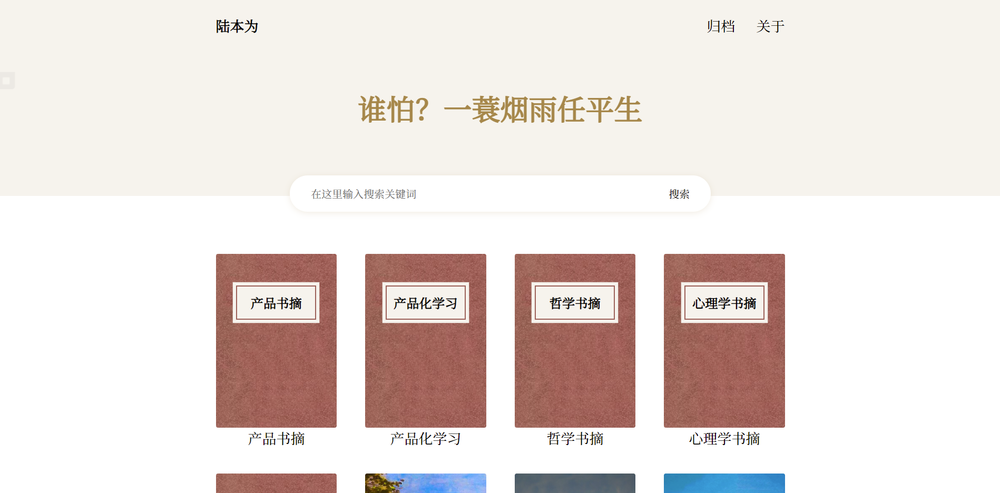
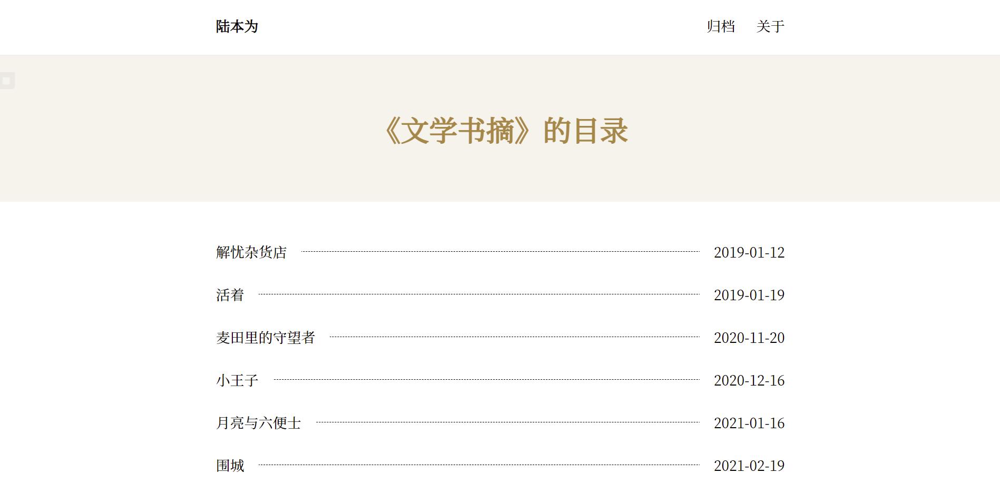
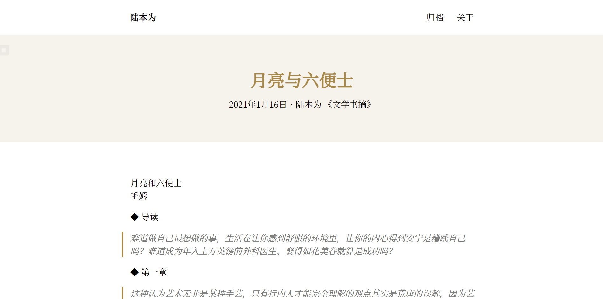
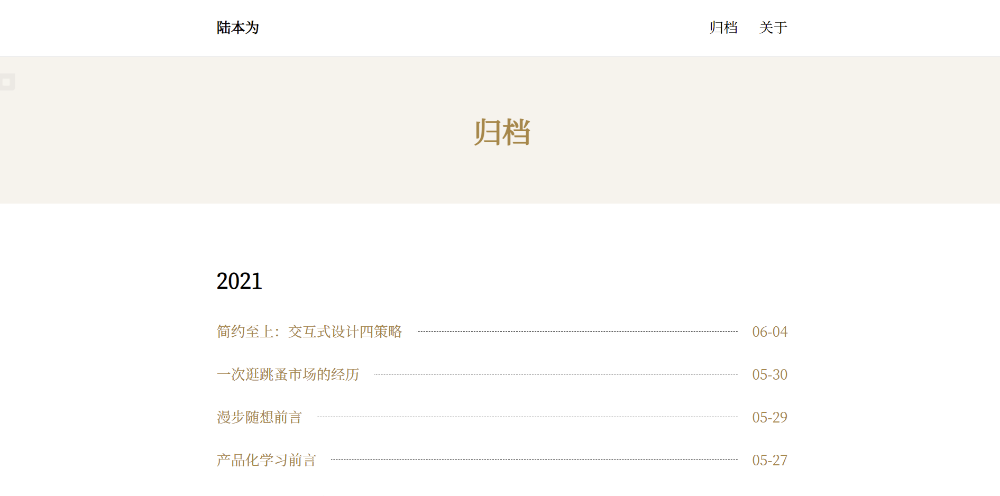

# 预览

|  |  |
| :----------------------------: | :------------------------------: |
|          首页（书架）          |          分类页（目录）          |
|        |          |
|             文章页             |              归档页              |

# 主题逻辑

| 对应博客逻辑 | 对应书的关系 |
| ------------ | ------------ |
| 首页         | 书架         |
| 一个分类     | 一本书       |
| 分类详情页   | 目录         |
| 一篇文章     | 目录中的一条 |

# 演示

欢迎将你的网站提交到这里来 [点我提交演示站点](https://github.com/Yet-The-Books/hexo-theme-yet-the-books/discussions/12) 或 [直接编辑（推荐）](https://github.com/Yet-The-Books/hexo-theme-yet-the-books/edit/main/README.md)

| 站点                                  | 状态                                                         |
| ------------------------------------- | ------------------------------------------------------------ |
| [陆本为](https://books.nexmoe.com/)       |  |
| [三味书屋](https://zain-books.vercel.app/)       |  |


# 使用
使用下面的命令进行安装（安装完就可以直接用了

```shell
npm i hexo-theme-yet-the-books
```

配置主题请更改根目录文件 _config.yet-the-books.yml

注意：使用本主题，你的文章必须得有一个分类

# 使用示例
https://github.com/nexmoe/books

# Front-matter

| 参数       | 描述                                                       | 默认值         |
| :--------- | :--------------------------------------------------------- | :------------- |
| `cover`    | 封面，需为图片目录或链接                                   | null           |
| `order_by` | 目录根据文章的什么排序（可选值：date,-date,title,url,...） | theme.order_by |
| `color`    | 封面颜色（可选值：red,purple,gray,blue,green）             | red            |

其他：https://hexo.io/zh-cn/docs/front-matter

# 社区
主题交流群：[🌙 还有书籍主题](https://jq.qq.com/?_wv=1027&k=4sLtwk78)
